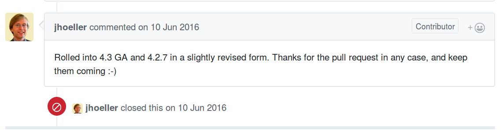
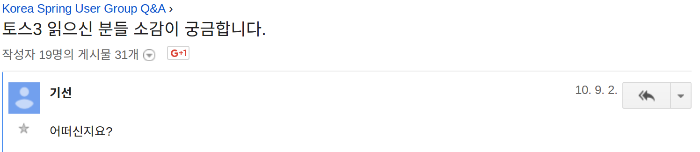
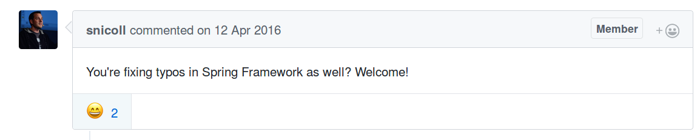

## 발표자

### 정상혁

--

### KSUG 3일꾼단 활동
--

### [네이버](http://recruit.navercorp.com/naver/job/list/developer) PaaS 소속

- 협업 플랫폼 개발, 사내 공통 프레임워크 기술 지원

--

### 네이버 기술 블로그 ( http://d2.naver.com/ ) 에 가끔 기고

---

# Spring/KSUG에 대한 기억 몇가지

--

## 발표내용
### Spring/KSUG를 돌아보면 생각나는 몇가지 이야기들

--

### 코드 구경

--

### 댓글

--

### 코드 기여

---

## 코드 구경

### Spring framework 에서 인상 깊었던 코드들

---

### 1. `RowMapperResultSetExtractor`
- spring-jdbc 모듈의 클래스
- .extractData() 메서드의 [2.0.1](http://grepcode.com/file/repo1.maven.org/maven2/org.springframework/spring/2.0.1/org/springframework/jdbc/core/RowMapperResultSetExtractor.java/) -> [2.0.2](http://grepcode.com/file/repo1.maven.org/maven2/org.springframework/spring/2.0.2/org/springframework/jdbc/core/RowMapperResultSetExtractor.java/) 의 변경

--

```diff
-// Use the more efficient collection if we know how many rows to expect:
-// ArrayList in case of a known row count, LinkedList if unknown
-List results = (this.rowsExpected > 0) ? (List) new ArrayList(this.rowsExpected) : (List) new LinkedList();
+List results = (this.rowsExpected > 0 ? new ArrayList(this.rowsExpected) : new ArrayList());
int rowNum = 0;
while (rs.next()) {
	results.add(this.rowMapper.mapRow(rs, rowNum++));
}
return results;
```

--

- List의 아이템 개수를 모를 때에도 LinkedList 대신 ArrayList로 변경
	- 받아 쓰는 쪽에서 List.get(i)로 접근하는 경우가 더 많이 때문에 바꾼 것으로 추정됨.  `	1q	`

---


### 2. AbstractCachingViewResolver
- ConcurrentHash과 LinkedHashMap을 함께 사용하여 Thread safe한 LRU Cache 구현
	- LinkedHashMap.removeEldestEntry를 override
- https://github.com/spring-projects/spring-framework/commit/06c6cbb6b92

---


```java
/** Fast access cache for Views, returning already cached instances without a global lock */
private final Map<Object, View> viewAccessCache = new ConcurrentHashMap<>(DEFAULT_CACHE_LIMIT);

/** Map from view key to View instance, synchronized for View creation */
@SuppressWarnings("serial")
private final Map<Object, View> viewCreationCache =
		new LinkedHashMap<Object, View>(DEFAULT_CACHE_LIMIT, 0.75f, true) {
			@Override
			protected boolean removeEldestEntry(Map.Entry<Object, View> eldest) {
				if (size() > getCacheLimit()) {
					viewAccessCache.remove(eldest.getKey());
					return true;
				}
				else {
					return false;
				}
			}
};
```

---

### 3. `ObjectUtils.nullSafeEqauls()` 관련 최적화
- https://github.com/spring-projects/spring-framework/pull/1076/commits
	- 해당 메서드가 굉장히 자주 호출됨.
	- 그러나 메서드가 길어서 디폴트 옵션으로는 method inlining 최적화의 혜택을 받지 못함
	- 그래서 메서드를 쪼개는 PR



---

## 느낀 점
- Java collection framework 활용, 최적화 기법
- Juergen Hoeller님은 Pull Request 를 잘 안 받아줌.
	- 유사한 사례 https://github.com/spring-projects/spring-framework/pull/652/files

---

## 댓글
기억나는 댓글들

---

### 1. List vs ArrayList 논쟁
- https://okky.kr/article/262881
- ArrayList를 List 인터페이스로 참조하는 스타일에 대한 댓글 배틀

--

> A님:
>
> List xxx = new ArrayList 로 사용하는 개발자가 전 생각없이 보이던데

--

> B님:
>
> ArrayList 가 최적인 경우에도 List xxx = new ArrayList 를 고집해야 하나요?


--

> benelog(정상혁):
>
> LinkedList를 ArrayList로 교체한 사례는 Spring프레임워크 2.0.1 -> 2.0.2로 넘어갈때의 아래 클래스의 사례가 생각나네요.

---

### 2. '토스3 읽으신 분들 소감이 궁금합니다.'

https://groups.google.com/forum/#!msg/ksug/sjc2QX2V9C8/ZJ54aFbanR0J




---


--


---

### 3. 지정된 JSON 속성만 반환하는 API 응답 만들기
http://stackoverflow.com/questions/26014943/serialize-only-mentioned-fields-in-spring-mvc-to-json-response/36488056#36488056


외국 아저씨한테 칭찬받으니 기분 좋음


---

### 느낀점
- 온라인으로 알게되는 사람도 생각보다 가까이 있다.
- 만날 일 없는 외국 개발자도 생각보다 우리와 비슷하다.

---

## 코드 기여

한국의 Spring 프로젝트 기여자 사례

---

### 1. 백기선 님
- 현 MS, 구 [네이버](http://recruit.navercorp.com/naver/job/list/developer) 소속 개발자
- [Spring-Test-MVC 프로젝트 소개](http://d2.naver.com/helloworld/1341)
	- [StatusResultMatchers](https://github.com/spring-projects/spring-framework/blob/master/spring-test/src/main/java/org/springframework/test/web/servlet/result/StatusResultMatchers.java#L33)
	- Spring Test MVC에 프로젝트에 기여.
	- Spring framework 3.2에 정식 포함됨

---


---

### 2. 임정묵 님
- 현 [네이버](http://recruit.navercorp.com/naver/job/list/developer) 소속 개발자
- spring-boot에 204개의 commit
	- Commit수로는 5위권의 기여자. Pivotal 직원이 아닌 사람 중에서는 1위
	- https://github.com/spring-projects/spring-boot/graphs/contributors


---

- [spring-framework에서도 환영받으심](https://github.com/spring-projects/spring-framework/pull/1030#issuecomment-208724922)



---

### 3. 발표자의 기여 시도
주로 회사 일과 연관되어서 발견한 이슈들

- [Spring Batch에서 retry-limit이 지정되면 commit-interval 설정이 먹히지 않음.](https://jira.spring.io/browse/BATCH-2096)
	- [5줄 추가하는 PR 날림](https://github.com/spring-projects/spring-batch/pull/227)
	- merged

---

- [Spring Batch 내부에 Enum에 명시되지 않은 DB를 JobRepository 로 쓸 수 없음](https://jira.spring.io/browse/BATCH-2175)
	- [이를 우회하는 PR 날림](https://github.com/spring-projects/spring-batch/pull/277)
	- PR는 반영되지 않음. 더 나은 방법으로 Spring Batch의 리더 Michael Minella가 해결해 줌
	- 3.0에 반영되었으나 친절하게 2.2.x에도 Backport patch해 주심.

---

- [Spring JDBC에 SimpleJdbcUpdate 추가](https://jira.spring.io/browse/SPR-4691)
	- 업데이트 SQL 구문을 자동 생성하는 클래스
	- Florent Paillard라는 분이 별도의 프로젝트로 만들었었으나 Spring framework쪽으로 옮길 의지가 부족해 보임
	- [Spring 4.2에 돌아가도록 Florent Paillard에게 먼저 PR](https://github.com/florentp/spring-simplejdbcupdate/pull/3), merged
	- Florent의 코드를 정리하여  [spring-framework쪽에 PR](https://github.com/spring-projects/spring-framework/pull/1075)
	- 오랜 시간이 지났으나 별반응이 없음. 기존 코드에 SimpleJdbcInsert에서 의존하는 코드를 너무 많이 건드려서 merge되기는 어려울듯.


---

### 기여에 관심이 있다면?
- 각 프로젝트의 [CONTRIBUTING.md](https://github.com/spring-projects/spring-framework/blob/master/CONTRIBUTING.md) 참조
	- spring-framework의 경우는 JIRA에 이슈 먼저 등록
	- Contributor License Agreement (CLA) 에 서명

--

- 기여 대상으로 분류된 이슈부터 보기
	- Spring Boot에서 [ideal-for-contribution](https://github.com/spring-projects/spring-boot/issues?q=is%3Aopen+is%3Aissue+label%3A%22status%3A+ideal-for-contribution%22) 라벨이 붙은 이슈
	- Spring framework에서 [Contributions Welcome](https://jira.spring.io/browse/SPR/fixforversion/13915/?selectedTab=com.atlassian.jira.plugins.jira-development-integration-plugin:release-report-tabpanel) 으로 버전이 붙은 이슈

--

- spring-framework보다 포트폴리오 프로젝트 쪽이 잘 받아준다.
	- spring-boot 가 가장 활발해 보임
	- spring-framework에 정식 포함되기 전에는 더 잘 받아줌
- Juergen Hoeller님보단 Stéphane Nicoll 님이 잘 받아준다

---

#### 별도의 프로젝트로 시작되어 공식 프로젝트에 포함된 사례
- Spring 3.0 전의 Java Config도 별도의 프로젝트
- [spring-projects/spring-test-mvc](https://github.com/spring-projects/spring-test-mvc) (현재는 삭제됨) -> spring-framework (spring-test) 3.2에 통합
- [spring-projects/spring-web-reactive](https://github.com/spring-projects/spring-web-reactive) (현재는 삭제됨 ) -> spring-framework (spring-webflux) 5.0에 통합
- [spring-projects/spring-test-htmlunit](https://github.com/spring-projects/spring-test-htmlunit) -> spring-framework (spring-test) 4.2에 통합
- [dsyer/spring-boot-mustache](https://github.com/dsyer/spring-boot-mustache) (Dave Syer의 개인 계정) -> spring-boot (spring-boot-starter-mustache) 1.2.2에 통합
- [bclozel/spring-boot-web-reactive](https://github.com/bclozel/spring-boot-web-reactive) (Brian Clozel의 개인 계정 ) -> spring-boot ( spring-boot-starter-webflux ) 2.0에 통합
- [sbrannen/spring-composed](https://github.com/sbrannen/spring-composed) (Sam Brannen의 개인계정) : spring-framework 4.3에 같은 역할을 하는 클래스가 반영

--

성공 확률이 높은 코드 기여는?

- Spring Boot에서 `ideal-for-contribution` 라벨이 붙어 있고 Stéphane Nicoll님이 댓글을 단 이슈
- 실험적인 프로젝트에 하는 기여
	- Pivotal 주요 개발자들의 개인 계정에 있는 경우도

---

## 돌아보니
- 코드 구경 -> 댓글 -> 기여 시도
- Spring/KSUG가
	- 더 적극적인 행동/넓은 사람들에 다가가는 디딤돌
