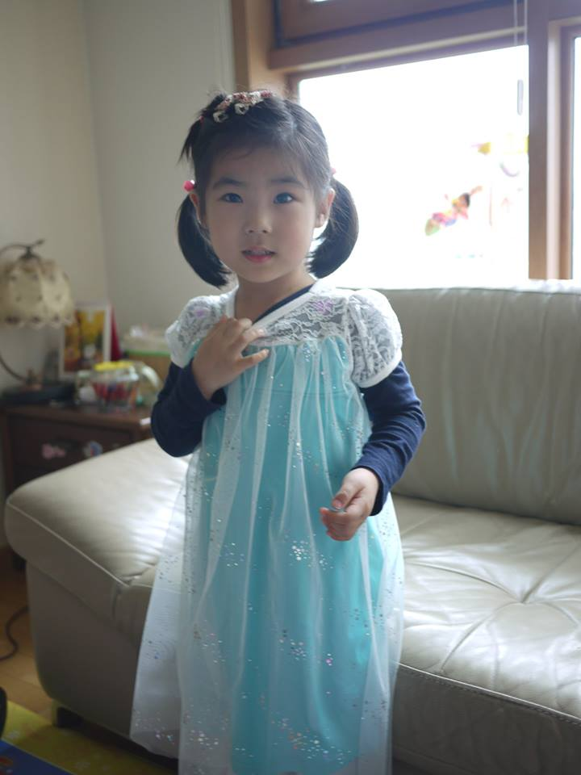

# 가족

--

--

- 아내, 첫째딸(2010.4), 둘째딸(2015.4 예정)
- 4.28 : 결혼기념일 = 첫째딸 생일 = 둘째딸 출산예정일

---

# 근래

--

## 회사에서 한 일
네이버에서 서비스개발/라이브러리 개발/기술지원/외부 업체 파견개발을 두루 경험

- 금융/동영상/주소록/미투데이 등의 개발조직과 함께 프로젝트 수행
- Java 프레임워크/라이브러리 관련 개발/기술지원
- 신입/상시 교육
- 주로 Java서버 개발
	- 그외 얄팍하게라도 이것저것 알려고 함

--

## 외부에도 보이는 일
- 기술 공유
	- Helloworld 블로그 글
	- Tech@Naver 시리즈 중 3권에 공저로 참여
- 외부 소스 패치
	- Spring Batch ( Java Batch framework) 버그 패치
	- Robolectric ( Android Test framework ) 버그패치, 기능 추가
	- Tzdata : 한국의 섬머타임 관련 오류 수정
- 잡다하고 작은 프로젝트 몇개 공개
	- <http://github.com/benelog>

---

# 경력

--

## 소속 직장들
- 2004.1 ~ : 삼성SDS
- 2008.2 ~ : NHN
- 2012.3 ~ : NHN Technology Service
- 2013.3 ~ : NHN Business Platform
- 2014.2 ~ : Naver Business Platforn
- 2014.7 ~ : Naver (NaverLabs)

--

네이버에서 사번이 3개!

--

## 대학전공
- 경영학/응용통계학
	- 취직을 했으니 전공을 살렸음
- 공대생 같다는 이야기를 많이 들음

---

# 관심사

--

## 좋아하는 것
- 책
	- 만화 : 언젠가 만화시나리오를 쓰고 싶음.
- 맥주
- 영화 음악 : 사람 목소리가 들리면 피곤해서.

--

## 별 관심없는것
- TV : 거의 안본지 6년째
- 차

---

# !
