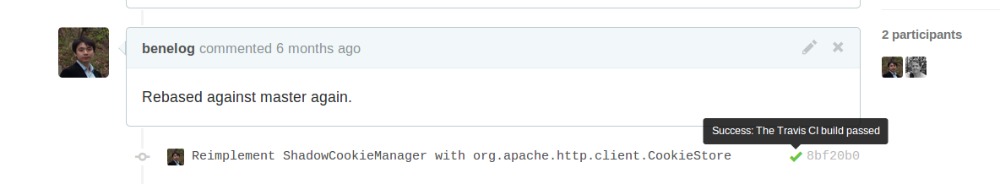

# 테스트 코드란?

--

## 검증을 위한 코드
	@Test
	public void testSchemeFile() throws Exception {
		String uri = "file://path/on/the/device/1.png";
		Scheme result = Scheme.ofUri(uri);
		Scheme expected = Scheme.FILE;
		assertThat(result).isEqualTo(expected);
	}

    @Test
    public void testSchemeUnknown() throws Exception {
		String uri = "other://image.com/1.png";
		Scheme result = Scheme.ofUri(uri);
		Scheme expected = Scheme.UNKNOWN;
		assertThat(result).isEqualTo(expected);
    }

( Android Universal Image Loader의 
[BaseImageDownloaderTest](https://github.com/nostra13/Android-Universal-Image-Loader/blob/master/library/test/com/nostra13/universalimageloader/core/download/BaseImageDownloaderTest.java)
)

--

## 테스트 프레임워크
- 테스트 실행 : JUnit
	- 안드로이드 SDK에서도 JUnit 기반의 테스트 프레임워크 제공
- 테스트용 가짜 객체 만들기 : Mockito, JMock, PowerMock
- 안드로이드를 위한 테스트 프레임워크
	- Robolectric, Robotium, Spoon, Robospock

--

## 왜 테스트를 코딩하는가?
- 디버깅 편의성
- 설계개선
- 동작하는 예제, 명세
- 회귀 테스트
- 집중력

--

## 유의할 개념
- JUnit으로 하는 테스트 != 유닛 테스트
	- Functional 테스트 (혹은 시스템 테스트)도 JUnit으로 작성하는 경우도 많다.
- 테스트 코드 작성 != TDD
	- TDD는 테스트를 작성하는 하나의 방식
	- TDD는 Test first -> Test 통과 -> Refactoring 단계를 거침

---

# 안드로이드 테스트의 장벽

--

## Mock을 쓰기 어려운 기본 프레임워크 구조
- 예: 상위클래스의 메소드를 호출
	- Activity.getViewById(int), getSystemService(String)

--

## 빈약한 기본 Mock클래스
- android.test.mock 아래에 MockContext, MockApplication, MockResource 등
	- UnsupportedOperationException을 던지는 껍데기일 뿐
- 필요한 동작은 직접 override해서 구현해야 함.

		static public class MockServiceContext extends MockContext {           @Overrride
        	public getSystemService(String name){
                ……
	    	}
		}

--

## Instrumentation Test의 높은 난이도
- 예: Activity를 테스트할때  ActivityTestCase, ActivityUnitTestCase, ActivityInstrumentationTestCase2의 세 가지 클래스 중 어느것을 써야할까?
- 많은 예외
	- ActivityUnitTestCase에서 Dialog생성 등에 Event가 전달되면 BadToken Exception이 발생
	- ActivityInstrumentationTestCase2에서 Dialog 객체를 생성 후 dismiss() 메서드를 호출하지 않으면 leak window Exception이 발생

--

## UI 테스트 본연의 어려움
- Layer의 역할상 UI 생성과 이벤트를 다루는 코드의 비중이 높음
	- 웹어플리케이션 등 다른 플랫폼에서도 테스트하기 어려운 분야
- 깨어지기 쉬운 테스트
- 익명 클래스 등을 통해서 처리되는 이벤트는 Mock 객체로 바꾸고 추적하기가 어려움

--

## 느린 테스트 실행
- 한줄을 고쳐도 패키징 -> 설치 -> 실행 싸이클을 거친다
- 가장 치명적

---

# Robolectric 활용

--

## Robolecric은?

	java.lang.RuntimeException: Stub!?

- IDE안에서 안드로이드 코드를 돌리면 위와 같은 에러가 남.
- Robolectric은 Android SDK가 제공하는 클래스에 가짜 동작을 심어서 JVM에서 Android 코드를 실행한다.

--

- 활발한 Github 프로젝트 : <https://github.com/robolectric/robolectric>
	- 174명의 기여자. Jake Wharton 등 유명 개발자도 참여
	- 꾸준한 발전
		- <http://robolectric.org/release-notes/>
		- Kitkat 이슈 : <https://github.com/robolectric/robolectric/pull/881>
- 구글에서 1.x버전을 자체 fork한 소스가 Android 소스 저장소에 있음
	- <https://android.googlesource.com/platform/external/robolectric/>

--

## 왜 유용한가?

	public class ViewParseUtils {
        private static final String TAG = "ViewParseUtils";

		public static Calendar parseDate(TextView view, DateFormat dateFormat) {
            String dateString = view.getText().toString();

            Calendar inputDate = Calendar.getInstance();
            try {
                inputDate.setTime(dateFormat.parse(dateString));
            } catch (ParseException e) {
                Log.i(TAG,"fail to parse : " + dateString);
                inputDate.setTimeInMillis(System.currentTimeMillis());
                // set today
            }
            return inputDate;
        }
	}

- JVM에서 테스트가 어려운 Android 코드
	- Android SDK 의존 클래스가 존재 ( Log, View)

--

### Mockito를 이용

    @RunWith(MockitoJUnitRunner.class)
    public class ViewParseUtilsMockTest {
        @Mock TextView input;
        SimpleDateFormat format = new SimpleDateFormat("yyyy-MM-dd", Locale.KOREAN);
		@Test
        public void validDate(){
            given(input.getText()).willReturn("2013-03-14");
            Calendar parsed = ViewParseUtils.parseDate(input, format);

            assertDate(parsed, 2013, 3, 14); // custom assert
        }
        @Test
        public void strangeButValidDate(){
            given(input.getText()).willReturn("2013-13-03");
            Calendar parsed = ViewParseUtils.parseDate(input, format);
            assertDate(parsed, 2014, 1, 3); // custom assert
        }
		@Test
        @Ignore // AndroidLog 코드에 걸려서 test가 fail한다.
        public void wrongDateFormat(){
            given(input.getText()).willReturn("2013/5/3");
            Calendar parsed = ViewParseUtils.parseDate(input, format);
            assertToday(parsed); // custom assert
        }

    ...
    }

( [ViewParseUtilsMockTest.java](https://github.com/benelog/bookmarker/blob/master/src/test/java/helloworld/android/util/ViewParseUtilsMockTest.java) )

- View의 기대동작을 Mock API로 지정해야함
- 'Log.i(..)'같은 Static 호출은 일반적인 Mocking 불가능
	- PowerMock을 쓰면 가능하긴 함

--

### Robolectric을 이용

	@Test
    public void validDate(){
    	input.setText("2013-03-14");
       	Calendar parsed = ViewParseUtils.parseDate(input, format);
        assertDate(parsed, 2013, 3, 14);
	}
    @Test
    public void strangeButValidDate(){
        input.setText("2013-13-03");
        Calendar parsed = ViewParseUtils.parseDate(input, format);
        assertDate(parsed, 2014, 1, 3);
    }
	@Test
    public void wrongDateFormat(){
        input.setText("2013/5/3");
        Calendar parsed = ViewParseUtils.parseDate(input, format);
        assertToday(parsed);
    }

( [ViewParseUtilsTest.java](https://github.com/benelog/bookmarker/blob/master/src/test/java/helloworld/android/util/ViewParseUtilsTest.java) )

- View 객체를 별도의 Mock없이 그대로 사용가능
- Log.i 같은 static 메서드도 바로 기본 동작을 수행

--

## Log를 System.out으로 출력하기

    @RunWith(RobolectricTestRunner.class)
    @Config(manifest = Config.NONE)
    public class SystemUtilsTest {

	@Before
	public void setUp() {
		ShadowLog.stream = System.out;
	}

- android.util.Log를 호출하는 클래스라도 JVM에서 바로 실행

--

## 단말의 SDK 정보를 원하는 값으로
    public static void setModel(String model) {
        Robolectric.Reflection.setFinalStaticField(Build.class, "MODEL", model);
    }

    public static void setManufacturer(String manufacturer) {
        Robolectric.Reflection.setFinalStaticField(Build.class, "MANUFACTURER", manufacturer);
    }

	public static void setOsVersion(String version){
        Robolectric.Reflection.setFinalStaticField(Build.VERSION.class, "RELEASE", version);
    }

	public static void setSdkVersion(int version) {
        Robolectric.Reflection.setFinalStaticField(Build.VERSION.class, "SDK_INT", version);
    }

- Build.VERSION 클래스 정보를 마음대로 설정 가능
	- Robolectric.Reflection.setFinalStaticField(..) 이용 
- Http호출을 하는 클라이언트에서 단말의 정보를 조합해서 userAgent를 생성하는 기능을 테스트할때 유용했음

--

## System서비스의 결과를 원하는 값으로

	public static void setDeviceId(String deviceId) {
		getTelManager().setDeviceId(deviceId);
	}

	public static void setNetworkOperatorName(String operatorName) {
		getTelManager().setNetworkOperatorName(operatorName);
	}

	private static ShadowTelephonyManager getTelManager() {
		Context context  = Robolectric.application;
		return  Robolectric.shadowOf((TelephonyManager) context.getSystemService(Context.TELEPHONY_SERVICE));
	}

--

## HTTP API 파싱 테스트
- 실제 API 서버를 호출해서 통합테스트해도 좋다
- 예상되는 호출결과를 고정해서 테스트하기
	- 예외 테스트에 특히 유용
    	- 비정상적인 응답 (예: 서버 점검 중일때 )
    	- 앞으로 변화가 예상되는 응답
    - 별도의 파일로 분리해서 관리하면 편리함
    	- 편집 용이성
    	- API 명세의 예제가 됨

--

### 통합 테스트 사례

    @RunWith(RobolectricTestRunner.class)
    @Config(manifest = Config.NONE)
    public class NaverSearchTest {
    
        @Test
        public void shouldSearch(){
    
            // given
            RestTemplate apiClient = createRestClient();
    
            Map<String, String> params = new HashMap<String, String>();
            String url = "http://openapi.naver.com/search?key={key}&target={target}&query={query}&start={start}&display={display}";
            params.put("key", "....");
            params.put("target", "news");
            params.put("query", "네이버 오픈세미나");
            params.put("start", "1");
            params.put("display", "15");

            // when
            Channel channel = apiClient.getForObject(url, Channel.class, params);

            // then
            @SuppressWarnings("unchecked")
            List<Item> items = channel.getItems();
            // assert대신 System.out으로 출력
        }

( [SearchServiceTest.java](https://github.com/benelog/bookmarker/blob/master/src/test/java/helloworld/android/resttemplate/bookmarker/service/SearchServiceTest.java) )

--

- Spring Android RestTemlate을 이용한 네이버 검색 오픈 API
- Robolectric이 없이 그냥 JUnit4만 쓴다면?
		java.lang.UnsatisfiedLinkError: android.util.Log.isLoggable(Ljava/lang/String;I)Z
		at android.util.Log.isLoggable(Native Method)
		at org.springframework.http.client.support.HttpAccessor.createRequest(HttpAccessor.java:85)
		at org.springframework.web.client.RestTemplate.doExecute(RestTemplate.java:472)

--

### 같이 쓸만한 라이브러리
- [Awaitility](https://github.com/jayway/awaitility)
	- 비동기 호출을 테스트
- [Mock Http Server](https://github.com/kristofa/mock-http-server)
	- 가짜 API서버를 쉽게 만듬

--

#### Awaitility + Mock Http Server 활용 사례
	@Test
	public void responseShouldBeParsedWithUnknownProperties() throws Exception {
		// Given
		responseProvider
				.expect(com.github.kristofa.test.http.Method.GET, "/")
				.respondWith(200, "application/json",
						"{\"name\":\"hello\", \"unknown\":\"unknown\", \"property\":\"unknown property\"}");

		// When
		Request<Person> request = new Jackson2Request<Person>(url,
				Person.class, listener, errorListener);
		requestQueue.add(request);
		with().await("testWhenUnknownPropertiesExist").until(
				wasListenerCalled(listener));
		// Then
		Person person = listener.getLastResponse();
		assertThat(person.name, is("hello"));
	}

( [Jackson2RequestIntegrationTest](https://github.com/naver/volley-extensions/blob/master/volley-extensions/src/test/java/com/navercorp/volleyextensions/request/Jackson2RequestIntegrationTest.java) )

- Volley(네트워크 라이브러리)를 활용한 비동기 호출을 테스트
	- 앞으로 속성이 추가되어도 기존 버전의 파싱메서드가 잘 동작하는지를 검증

--

## DisplayMetricsDensity

    @RunWith(RobolectricTestRunner.class)
    @Config(manifest = Config.NONE)
    public class PixelUtilsTest {
        private Context context;

        @Before
        public void setUp() {
            ShadowLog.stream = System.out;
            this.context = Robolectric.application;
        }

        @Test
        public void shouldGetDpFromPixel(){
            Robolectric.setDisplayMetricsDensity(1.5f);
            int dp = PixelUtils.getDpFromPixel(context, 50);
            assertThat(dp, is(33));
	}

( [PixelUtilsTest](https://github.com/naver/android-utilset/blob/master/UtilSet/test/com/navercorp/utilset/ui/PixelUtilsTest.java) )

- [org.robolectric.Robolectric](https://github.com/robolectric/robolectric/blob/master/src/main/java/org/robolectric/Robolectric.java) 클래스의 다양한 메서드를 활용할 수 있다

--

## View 의존 테스트

	@Test
	public void shouldChangeScreenBrightness() {
		TestActivity activity = createActivity(TestActivity.class);
		float brightness = 0.5f;
		ScreenUtils.setScreenBrightness(activity, brightness);

		LayoutParams lp = activity.getWindow().getAttributes();

		assertThat(lp.screenBrightness, is(brightness));
	}

    private <T extends Activity> T createActivity(Class<T> activityClass) {
            ActivityController<T> controller = Robolectric.buildActivity(activityClass);
            controller.create();
            return controller.get();
	}

( [ScreenUtilsTest](https://github.com/naver/android-utilset/blob/master/UtilSet/test/com/navercorp/utilset/ui/ScreenUtilsTest.java) )

- Activity는 ActivityController를 이용해서 생성

--

### [assertj-android](https://github.com/square/assertj-android)

    assertThat(layout).isVisible()
        .isVertical()
        .hasChildCount(4)
        .hasShowDividers(SHOW_DIVIDERS_MIDDLE);

- View객체에 대한 assert를 편하게 해주는 도우미 라이브러리

--

## 어떻게 활용할 것인가?
- 문자열, 날짜 처리, 프로토콜 파싱 영역에서 이득이 많다
	- java.lang, java.util , java.io 패키지가 다루는 영역에 우선 집중
    - 특히 예외 상황
	- UI영역의 테스트에 너무 많은 기대를 걸지는 말자
- Utility 클래스부터 시작
- 버전 2.3부터는 실제 Sqlite 구현체를 이용하기 시작
	- DB관련 테스트도 시도해볼만함
- 테스트의 이득이 높은 영역을 분리해서 설계하라
	- 재활용/기능 추가/버그 발견에도 좋은 구조가 될것이다.

---

# 코드 기여

--

## Javadoc의 오타부터
<https://github.com/robolectric/robolectric/pull/804>

- ShadowCookieManager의 javadoc에서 TelephonyManager-> CookieManager 오타 수정

--

## ShadowCookieManager 재구현
<https://github.com/robolectric/robolectric/pull/853>

- Robolectric 2.2까지는 단순히 HashMap에 key,value를 저장하는 수준
- Expires같은 속성이 들어가면 실제 SDK와 다르게 동작함. (아래 코드는 fail)

        cookieManager.setCookie(httpUrl, "name=value; Expires=Wed, 11 Jul 2035 08:12:26 GMT");
        assertThat(cookieManager.getCookie(httpUrl)).isEqualTo("name=value");

--

- 실제 단말에서의 동작을 AndroidTestCase로 확인 

		CookieManager cookieManager;

        public void setUp() {
            Context context = getContext();
            CookieSyncManager.createInstance(context);
            cookieManager = CookieManager.getInstance();
            cookieManager.removeAllCookie();
        }

		public void testRemoveExpiredCookie() {
			cookieManager.setCookie(url, "name=value; Expires=Wed, 11 Jul 2035 10:18:14 GMT");
			cookieManager.setCookie(url, "name2=value2; Expires=Wed, 13 Jul 2011 10:18:14 GMT");
			cookieManager.removeExpiredCookie();
			assertEquals("name=value", cookieManager.getCookie(url));
		}

<https://gist.github.com/benelog/7655764>

--

- 유사한 테스트 케이스를 Robolectric으로 작성

		CookieManager cookieManager = Robolectric.newInstanceOf(CookieManager.class);;
		@Test
		public void shouldRemoveExpiredCookie() {
 			cookieManager.setCookie(url, "name=value; Expires=Wed, 11 Jul 2035 10:18:14 GMT");
			cookieManager.setCookie(url, "name2=value2; Expires=Wed, 13 Jul 2011 10:18:14 GMT");
			cookieManager.removeExpiredCookie();
            assertThat(cookieManager.getCookie(url)).isEqualTo("name=value");
		}

- 이를 통과시키는 ShadowCookieManager를 구현하여 Pull request
- Robolectric에 들어갈 코드를 Robolecric으로 검증했음

--

## ShawdowProcess 구현
<https://github.com/robolectric/robolectric/pull/861/>

- android.os.Process.myPid()에서 나오는 값을 가짜로 지정할 수 있도록

    	@Test
    	public void shouldBeTrueWhenThisContextIsForeground(){
            int pid = 3;
            ShadowProcess.setPid(pid);
            createRunningAppProcessInfo(pid);
            boolean foreground = ActivityUtils.isContextForeground(context);
	        assertThat(foreground, is(true));
        }
- Android 소스 저장소의 Robolectric fork판에도 유사한 클래스가 있음

--

## 코드 기여할 때 유의할 점
- master의 최신 커밋으로 rebase
- 적절한 테스트 코드를 같이 커밋
	- Local PC에서 모든 테스트를 돌려보고 커밋 (mvn test)
	- Travis CI 통과를 확인
	
- <http://robolectric.org/contributor-guidelines/> 참조
	- Indent에는 탭대신 공백 2칸

---

# 정리

--

- Android 테스트는 난관이 많다
	- 특히 느린 실행속도
- Robolectric이 도움이 된다
- 테스트하기 쉬운 영역부터
	- 문자열, API 파싱. 유틸리티
	- 궁극적으로는 설계개선을 고민
- 코드 기여도 어렵지 않다
	- 기여자에게 관대하다

--

## 참고자료
- [Android에서 @Inject, @Test](http://helloworld.naver.com/helloworld/342818) (helloworld 블로그)
- Gradle + Robolectric 설정 예제
	- <https://github.com/kvandermast/my-robolectric-app>
	- <https://github.com/robolectric/deckard-gradle>