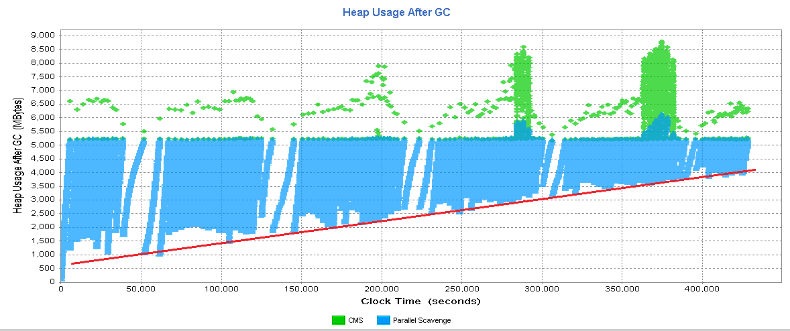
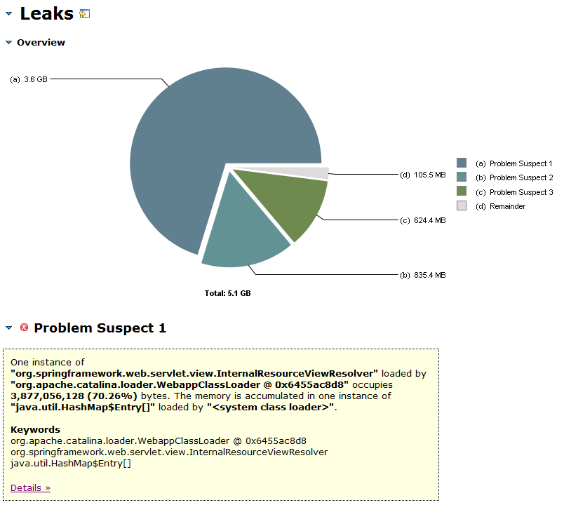
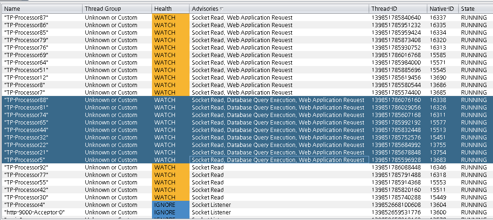
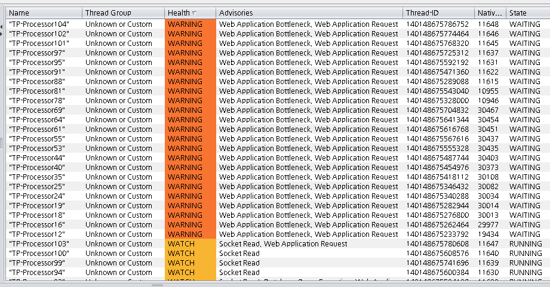
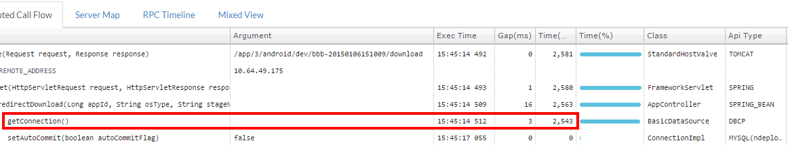
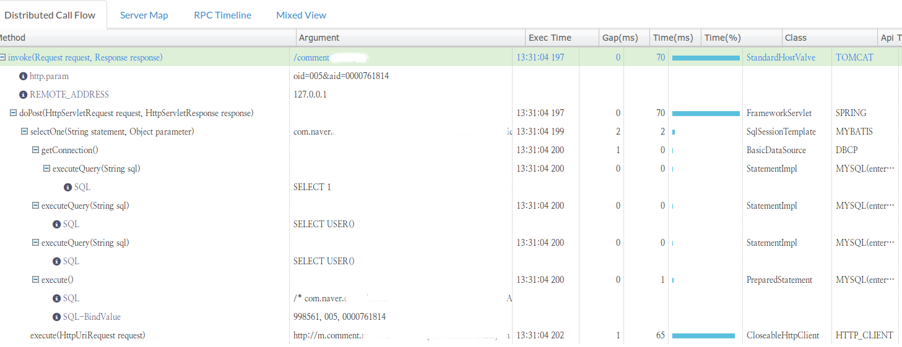
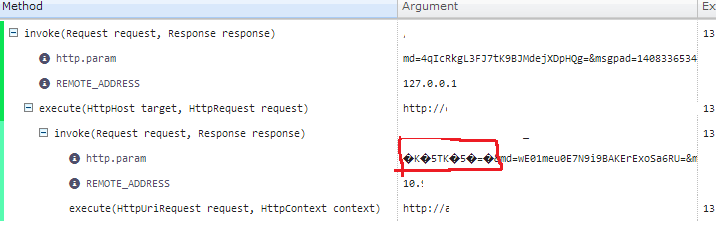
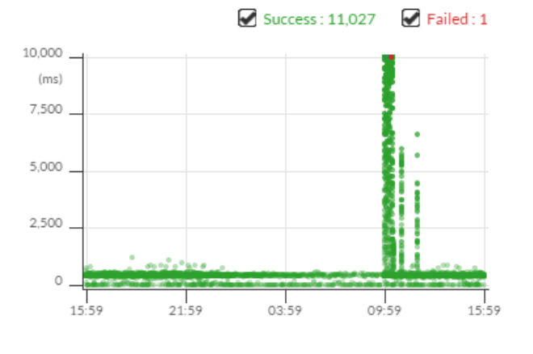

## 발표자 소개
- 소속 : 네이버 > 네이버랩스 > 웹플랫폼개발랩
- 업무 : Java 기술지원, 신규 프로젝트 개발, 교육
- http://helloworld.naver.com 에 가끔 글 올라감

---

# 트러블 슈팅 지원의 패턴

--

## 트러블 슈팅을 위한 정보 파악 단계
- A단계 : 사용자 현상 파악
    - 503/500 에러
    - 무응답/느린 응답
    - 예상과는 다른 어플리케이션 동작 (예) 간헐적 인증 실패)

--

- B단계 : 서버 상태 파악
    - 어플리케이션 서버
        - 메모리 사용률 (Swap 사용여부 )
        - CPU 사용률
        - Disk 용량, I/O
    - 연계서버 상태 (Database 서버 등)

--

- C단계: 어플리케이션의 정보 파악
    - 어플리케이션 로그
        - OOM 등 전형적인 Fatal 여러 발생여부
        - 자주 발생하는 에러 스택
    - WAS의 주요 설정
    - 소스
    - 스택덤프
    - GC로그
    - 힙덤프
    - 실행경로 프로파일링

--

### 정보파악 단계를 다시 정리하면
- A단계 : 사용자 현상 파악
- B단계 : 서버 상태 파악
- C단계 : 어플리케이션의 정보 파악
- 뒷 단계로 갈수록 취득 비용이 비쌈.

--

### 트러블 슈팅 요청자의 대부분은
- A,B단계의 정보는 쉽게 공유함
- C단계 중 쉽게 취득할 수 있는 것부터 공유하면서 자문을 요청

--

- C단계 (어플리케이션의 정보)는
   - 종합적으로 연결해서 봐야함
   - 취득, 분석 비용이 비쌈
   - 힙덤프
        - 서비스 운영 중에는 덤프를 뜰 수 없다.
        - 덤프 파일의 용량이 커서 파일을 주고 받기도 어렵다
   - 프로파일링
        - 운영중에 할 수는 없다.

--

### 지원 요청의 많은 경우 공통점은
- 개발환경에서는 괜찮았어요
- 운영환경에서도 평소에는 괜찮았어요
    - 불규칙적으로 발생해요 또는
    - 부하가 몰리면 이상해져요

--

### 즉, 트러블 슈팅 지원 요청은
- 이럴 경우 많이 온다
    - 운영 환경에서 드물게 발생하는 문제에 대해서
    - 어플리케이션 정보를 더 깊이 분석하고자 하는 단계에서

--

## 지원요청의 등급

### 최악의 지원 요청은?
- '에러가 나요, 도와주세요!'만 이야기하고 자세한 정보를 알려주지 않음
    - 회사에서는 그런 분이 없다.
    - 인터넷 게시판에 보면 종종 보인다.

--

### 최악은 아니지만...
- A,B,C 단계의 상세한 정보 없이 해야할 일을 정해서 요청
    - GC 튜닝해주세요

--

### 수준 높은 지원 요청은
- 추론 과정과 증거까지 공유
- 스스로 생각하는 해결방식이 있지만, 더 나은 방식을 찾는 문의
    - 해결방식에 대한 부작용 여부 확인
    - 다른 부서의 유사 사례 문의

--

### 최고의 지원 요청은?
- 지원 요청을 하지 않는 것
- 알아서 해결하고 과정과 배경 정보까지 다 정리해서 다른 부서에도 공유해달라고 알려주는것

--

## 문의가 오면 주로 추가로 확인을 하는것들
### 현상의 일관성 확인
- 재현 조건
- 사용자에게 항상/간헐적으로 나타나는지
- 일부/전체 서버에 나타나는지
    - 전체 서버는 공통 자원과 설정을, 일부 서버면 Thread 안정성 문제를 먼저 의심

--

### 정보 중 누락된것이 있으면 추가 요청
- 주로 C단계의 정보를 취득 비용이 싼 것부터 점진적으로 요청
    - 현재 사용 중인 JVM 옵션을 알려주세요
    - 스택덤프를 3-5초 간격으로 3-5개 정도 떠서 보내주세요
    - 소스 저장소 권한 주세요
    - GC 로그 확보해 주세요

--

### 문제상황에서 분석을 도와주는 옵션 추천
- 자세한 GC log를 위한 옵션의 예
        -verbose:gc
        -XX:+PrintGCDetails -XX:+PrintGCTimeStamps
        -Xloggc:../logs/gc-was1.log
        -XX:+UseGCLogFileRotation
        -XX:NumberOfGClogFiles=5
        -XX:GCLogFileSize=256M
    - Java6 update 24, Java7 update 2부터는 gc log roate를 지원

--

- OOM시 힙덤프 옵션의 예
        -XX:+HeapDumpOnOutOfMemoryError
        -XX:HeapDumpPath=../logs/heap-was1.log
    - gcore 덤프도 함께
            -XX:OnError="gcore%p"
    - sar 로 시스템 상황을 남기기도 함.
            -XX:OnOutOfMemoryError="/usr/bin/sar -A > ../logs/sar.log"
            -XX:OnError="/usr/bin/sar -A > ../logs/sar.log"

--

## 자주 만나는 해결 방식

###  해결유형1: 인프라 요소 설정 변경
- 어플리케이션의 로직과는 상관없이 공통적인 설정을 변경해서 해결하는 경우
- 현상의 사례
    - A. 사용자가 몰릴 시 간헐적 느린응답, 500, 503에러
    - B. Swapping 영역 사용.
    - C. 잦은 GC, OOM, Connection pool의 getConnection()에서 대기
- Database 등 공용 외부 자원에서 병목이 있을 때 부적절한 설정 때문에 상태를 악화시키거나 방어하지 못하는 경우가 많음.
- 모든 서버에서 같은 현상이 발생하기 쉬움.

--

- 주로 건드리는 핵심 설정
    - ConnectionPool
        - DBCP :  maxActive (maxTotal), maxWait (maxWaitMills), validation query
    - JDBC : Socket timeout 등
    - Web Server
        - Apache Httpd : maxClients
    - Web Application Server
        - Tomcat: maxThreads, AJP connector의 backlog 값
    - JVM : GC option

--

- 적절한 값을 설정하는데 도움이 되는 자료
    - Apache MaxClients와 Tomcat의 Full GC : <http://helloworld.naver.com/helloworld/textyle/132178>
    - JDBC 타임아웃 이해하기 : <http://helloworld.naver.com/helloworld/textyle/1321>
    - Tech@Naver 10번째책 - Commons DBCP 이해하기
    - Garbage Collection 튜닝 : <http://helloworld.naver.com/helloworld/37111>

--

### 해결유형2: 메모리릭 경로 제거
- 현상의 사례
    - C. 서버 올린지 오래되면 잦은 GC. OOM
- 주로 Cache 로직에서 발생
    - 해당서비스팀에서 직접 만든 캐쉬 로직이 있는가?
    - 캐쉬 용량의 한도값이 적절한가?
    - 모든 서버에 같은 현상이 궁극적으로는 생김.
- Thead 불안정성에 의한 메모리릭
    - 일부 서버에만 OOM 발생

--

### 해결유형3: 무한 루프 경로 제거
- 현상의 사례
    - B. 100%에 가까운 CPU 사용. 특정 서버에서만 발생하는 경우가 많음.
    - C. 스택덤프를 뒤져보면 계속 실행 중인 스레드가 있음. 모든 CPU가 100%가 걸리면 덤프조차 못 뜰수 있음.
- 특정 조건이 들어왔을때 혹은 Thread 불안정성 때문에 생기는 무한루프가 많음.
	- 부조건 무한루프였으면 개발할때 모를리가 없음.
- 잘못된 정규식에서 발생한 사례도 있음

---

# 트러블 슈팅 사례

--

## 사례 1 : CMS GC에서 긴 Stop the world

### 최초 공유된 정보
- C. 어플리케이션의 정보
    - 수십기가의 힙 사용
    - Stop the world가 길게 발생

--

### 분석
- Hpjmeter 로 GC log를 시각화해서 확인
- CMS GC가 길어지는 대부분의 원인인 promotion fail (concurrent mode fail)의 경우였음.
    - old 영역의 파편화로 큰 객체가 들어갈 공간이 없어질 때 compaction 수행

--

### 참고
Promotion fail GC 로그의 예

    2185 GC locker: Trying a full collection because scavenge failed
    2186 251.229: [Full GC 251.229: [CMS251.495: [CMS-concurrent-mark: 6.443/8.877 secs] [Times: user=30.14 sys=3.55, real=8.87 secs]
    2187  (concurrent mode failure): 3976820K->354739K(4135360K), 0.9792960 secs] 4192291K->354739K(5065792K), [CMS Perm : 42722K->42722K(71212K)], 0.9794580 sec     s] [Times: user=0.96 sys=0.02, real=0.98 secs]

--

### 해결
- CMS GC 수행 시점을 앞당김
        -XX:CMSInitiatingOccupancyFraction=70 -XX:+UseCMSInitiatingOccupancyOnly
    - CMSInitiatingOccupancyFraction의 값을 70으로 주면 70%정도 old gen이 찾을 경우 cms gc를 시작. 더 많은 가용공간을 확보된 상황에서 gc를 하기 때문에 promotion fail이 발생할 확율을 줄여줌

--

## 사례의 의의
- JVM 옵션 변경만으로 문제를 해결한 사례
- 설정변경(해결유형1)의 FAQ 중 하나

--

## 사례 2: 서버가 뜨자마자 Full GC가 자주 발생

### 최초 공유된 정보
- B. 서버 상태
    - DB서버의 IO 트래픽이 높음
- C. 어플리케이션 정보
    - 웹서버를 시작하면 Full GC가 매우 빈번하게 발생합 (약 5초에 1~2번)
    - Full GC가 발생할 때 힙덤프를 떠서 확인을 해보니 엄청난 양의 com.mysql.jdbc.ByteArrayRow객체가 생성
    - 소스에는 많은 건수를 조회하는 SQL이 없음
    - 같은 소스로 개발서버에서는 문제가 없었음.
    - 프레임워크 문제인가 싶어서 변경도 해봤음.

--

### 분석
- 힙덤프를 분석해서 대량의 ResultSet을 가지고 오는 형상으로 파악
- 소스 분석 결과 DBCP설정의 validationQuery가 데이터가 존재하는 테이블을 조회하고 있었음
        SELECT 0 FROM USERS

--

### 해결
- validationQuery 속성 수정

--

### 참고
- 권장하는 validationQuery 설정
    - Oracle : SEELCT 1 FROM dual
    - MS SQLSERVER : SELECT 1
    - Mysql : SELECT 1
    - Cubrid : SELECT1 FROM db_root
- DBCP 2.0에서는 validationQuery 속성이 없으면 Connection.isValid() 를 호출해서 유효성 검사
    - 구현은 JDBC 드라이버마다 다를 것임.

--

### 사례의 의의
- 담당자가 많은 고생을 했으나 알고 보니 허무했던 사례
- 결국은 설정변경 사례

--

## 사례 3 : GC를 수행 중 응답시간이 늘어남
### 최초 공유된 정보
- A. 사용자의 현상
    - 특정 시간대에 갑자기 응답시간에 늘어남
    - 긴 추석연휴의 마지막에 발생
- C. 어플리케이션의 정보
    - EhCache를 최대 6G까지 쓸 수 있도록 설정해서 메모리를 10G정도로 많이 잡고 있음.
    - 문제의 시간대에 GC하고 있음.
    - 힙이 커서 GC시간이 길어지고 있는것으로 추정
        - newRatio등의 값을 튜닝 중

--

### 분석
- 처음에는 `jstat --gcutil`로 얻은 정보를 전달받음
    - 평균 GC 수행시간만 있음
- 개별 GC의 정보 파익이 필요해서 verbose GC 로그 요청
- GC로그 분석결과 점진적으로 사용메모리가 증가하는 그래프 파악
   - 개발 담당자는 EHCache 적용의 영향으로 판단했을 수도 있음

--

- 힙덤프 요청
    - 힙덤프에서 메모리의 대다수를 점유하고 있는 객체 발견

--

- 원인
    - Spring 프레임워크 내부의 객체 Cache로직에서 메모리릭 발생
        - Spring 3.1.4와 3.2.GA버전에서 방어코드가 들어갔으나 해당 어플리케이션은 이전 버전 사용
    - Controller 메서드에서 `"redirect:" + 데이터의 ID` 형식의 viewName을 반환하는 경우 발생
            return "redirect:form.html?entityId=" + entityId;

--

### 해결
- 어플케이션 코드 수정
    - 스프링 프레임워크의 버전을 올리지 않고 가능한 방법
            return new RedirectView("form.html?entityId="+entityId);
    - <http://www.slideshare.net/benelog/ss-35627826> 의 11 페이지 참고
        - 그외의 방법과 에러에 대한 자세한 분석

--

### 사례의 의의
- JVM 설정의 문제로 추측했으나 결국은 메모리릭의 문제
- 메모리릭은 OOM까지 이르기 전에 다른 이상 현상을 보이기도 한다.

--

## 사례 4 : 가끔씩 발생하는 OOM
### 현상
- 몇달에 걸쳐 서비스 담당부서의 노력으로 원인을 찾아낸 사례
- A. 사용자 현상
	- 간헐적인 503에러
- C. 어플리케이션 상태
	- 장비 1대에서 OOM 에러
- 힙을 늘려주고 몇달 동안 발생을 안 했으나 가끔씩 또 발생

--

### 분석
- 힙덤프 분석결과 LinkedHashMap 관련 객체가 대다수 힙을 차지
- 자체 cache모듈의 thread-safetey 문제로 발생한 메모리릭
    - LinkedHashMap.put은 synchronized 블록 안에서 호출 get은 그렇게 하지 않았을 때

--

### 해결
- LinkedHashMap.get에도 동기화 처리
    - JDK5였으면 ConcurrentHashMap 등을 고려할수도 있었을 듯
- '네이버를 만든 기술 읽으면서 배운다- 자바편'의 '하나의 메모리누수를 잡기까지' 참조

--

## 사례의 의의
- 메모리릭 문제이나 Thread safety가 원인이라 분석이 쉽지 않았음.
- 자체 구현한 cache 로직, DataSource 구현체는 늘 주의의 대상

--

##  참고
- HashMap에 대한 Thread saftey 문제는 무한루프로 나타나기도 함
    - Beautiful race condition : <http://mailinator.blogspot.kr/2009/06/beautiful-race-condition.html>
    - `private Map`으로 전체 소스 검색 해볼만 함
- XStream 라이브러리 사례의 무한루프 사례 <http://jira.codehaus.org/browse/XSTR-584>
    - WeakHashMap을 Thread safe하지 않게 접근한 버그
    - 몇년동안 같은 버전으로 잘 쓰다가 고사양 장비(네할렘)으로 옮기니 장애 발생
- 같은 Thread-saftey문제라도 메모리릭으로 나타나면 해결이 더 괴로움

--

## 교훈
- 요청하는 사람의 말을 100% 믿지는 말아야겠다.
   - 정보를 종합하지 파악하지 못 해서 오판한 경우도 있다
    - 예) 'GC 튜닝해주세요'라고 온 요청을 보면 메모리릭
        - 분석 후 메모리 릭이라고 알려줬는데도 다른 사람에게 GC튜닝을 요청한 사례도...
    - 예) java 레벨의 성능 튜닝을 해주세요 해서 들여다 봤더니 느린 쿼리가 문제

--

- 복합적인 원인도 많다
    - 단순히 증상만으로 판단할 수 없다. 여러 정보를  복합적으로 봐야한다.
    - 같은 결함이 다른 요인과 얽히면 현상이 다르게 나타난다,
        - 예1) DB병목 -> 요청 적체 -> 503 에러
        - 예2) DB병목 + 과도한 동시사용자 허용(maxActive, maxThread) + 적은 힙 메모리 ->  메모 과다 점유 -> OOM
    - 어플리케이션의 코드 + 라이브러리의 코드
        - 양쪽을 다 확인해야 문제 파악이 가능하다.
        - 한 사람이 둘 다 알지 못한다면 긴밀한 협업이 필요하다.
- 같은 현상이라도 근본원인이  다른 경우도 있다.
    - 예) 메모리릭 -> 점진적 메모리 사용 증가 -> Stop the world가 길어짐

--

- 수집 비용이 싼 정보로 원인을 밝혀낼 수 있다면 해결이 더 빠르다.
    - 싼 비용으로 수집할 수 있는 정보는 개발담당자가 먼저 확인을 잘 해본다.
        - WAS와 DB의 자원 모니터링, 어플리케이션 로그, 소스,  스택덤프
    - 힙덤프까지 가면 취득/분석비용이 비싸다.

---

# 추천하는 도구

--

## 쓰레드 덤프 분석
- TDA
     - <https://java.net/projects/tda>
- Tread Logic
    - <https://java.net/projects/threadlogic>
    - TDA + Alpha : 툴이 분석한 병목 등을 제시해 줌

--

Threadlogic은 DB쿼리를 실행하는 스레드를 알아보기 쉽게 표시 해줌

--

Threadlogic은 Bottleneck 의심 스레드를 추천해주기도 함

--

### TIP
- 덤프뜰때 `kill -3`하려다 `kill -9`실수 하지 말길..
   - `jstack` 활용
   - 진짜 죽이고 싶을 때는 `kill -kill` 습관을..

--

##  힙덤프
- MAT (Eclipse Memory Analyzer)
    - <https://eclipse.org/mat/>
- IBM Heap analyzer
    - <ftp://public.dhe.ibm.com/software/websphere/appserv/support/tools/HeapAnalyzer/ha456.jar>

--

### TIP
#### 대용량 힙덤프 분석
- MAT에서 MemoryAnalyzer.ini 파일의 옵션 수정 필요
        -vmargs
        -Xmx8g

--

#### 덤프 파일의 전송
- 다운로드
    - python이 깔려있는 서버라면
            python -m SimpleHTTPServer
- 업로드
    - one-ftp-server : <https://github.com/benelog/one-ftpserver>
            java -jar one-ftpserver.jar port=10021 id=benelog password=1234
        - 명령어 1줄로 port, id, password를 지정해서 띄울 수 있는 ftp 서버

--

## GC로그 분석
- HPJmeter
    - <https://h20392.www2.hp.com/portal/swdepot/displayProductInfo.do?productNumber=HPJMETER>

--

## 프로파일러
- Yourkit
    - <https://www.yourkit.com/>
- JProbe
    - <http://marketplace.eclipse.org/content/jprobe>

--

## 실행 탐지
- Btrace
    - <https://kenai.com/projects/btrace>
    - 특정 메서드 호출 추적
    - JVM 옵션 변경없이도 붙일수 있다.

--

DAO 레이어의 호출횟수, 실행시간 측정 스크립트

    @OnMethod(clazz = "/com\\.naver\\.good\\.service\\.work\\..*DAOImpl/",
             method = "/.*/",
             location = @Location(Kind.RETURN))
     public static void dao(@Duration long duration, @ProbeClassName String className,
                     @ProbeMethodName String probeMethod) {
         String callName = concat(concat(className , "."), probeMethod);
         AggregationKey aggregationKey = Aggregations.newAggregationKey(callName);
         Aggregations.addToAggregation(daoDuration, aggregationKey, duration/1000);
         Aggregations.addToAggregation(daoCount, aggregationKey, 1L);

     }

--

## 한계
- 덤프, 프로파일링
    - 상시적으로 할 수는 없다.
- Brace
    - 목적이 명확할때만 쓸만하다.
        - 예) 프레임워크에서 로깅해주지 않는 파라미터 값을 운영서버에서 추적
        - 예) 특정 레이어의 실행시간 비중 파악
     - 스크립트 작성이 번거롭다

--

- 도구는 도구일 뿐이다.
    - 도구 사용법이 진입장벽이 높은 지식은 아니다.
    - 도구 자체가 문제를 해결해주지는 않는다.
        - 해석, 추론 과정이 더 중요하다.
    - 덤프에서 나오는 클래스, 라이브러리에 대한 지식이 있어야 근본 원인을 파악할 수 있다.

---

# Pinpoint 활용 사례

--

## Pinpoint는?
- 네이버의 APM
    - 많은 요청을 처리하는 네이버의 실서비스에 적용
- 분산 시스템 호출에 특화
    - <http://helloworld.naver.com/helloworld/1194202> 참조
- 오픈소스
    - <http://github.com/naver/pinpoint>

--

## DB 호출 모니터링 사례
- 가장 흔한 어플리케이션의 병목
- Dynamic query, ORM 등 쿼리 생성 조건이 복잡한 경우 더욱 유용했음
- Connection poool 설정으로 인한 결과를 바로 확인 가능

--

### 느린 Dyanmic query 확인
- 조회 조건에 따라서 where 절의 구성이 달라지는 쿼리
- DBA도 사전에는 엄격하게 확인하지 못하는 경우가 많음
- Pinpoint로 운영서버에서 특정 조건일때만 느려지는 쿼리를 파악하여 튜닝을 했음

--

###  ORM의 동작 확인
- 쿼리가 호출되는 시점이나 횟수, 생성되는 쿼리를 개발자가 잘 예측하지 못하는 경우도 있음.
    - Local에서 로그로 확인이 가능하지만 시각적으로 확인이 편하지는 않음.
- 사례 : JPA를 쓰는 서비스에서 파일을 다운로드는 긴 요청에 OpenEntityManagerInViewFilter가 적용되어서 불필요하게 길게 Connection을 보유하는 상황
    - Pinpoint로 모니터닝해서 DataSource.getConnection() 메서드 대기하고 있는 것을 확인
    - 문서 수정 후 같은 현상이 없음을 다시 확인

--

### 분산 트랜잭션의 비용 파악
- 2PC commit은 과연 얼마나 느린지 실제로 확인

--

### 과도한 validation query
- DBCP의 testOnBorrow속성이 true로 되어 있어어 매번 실제 쿼리 호출전에 validation query가 날아가는 현상
   - 부적절한 설정 사례
- DBCP설정 소스를 보지 않고도 pinoint 모니터링으로 바로 파악

--

## Server to server API 호출 모니터링 사례
- 서버 간의 호출여부, 응답이 느린 API서버와 구간별 정보를 바로 파악할 수 있음.

--

### 에러가 나는 요청의 request 정보 확인
- Http 요청의 파라미터 확인으로 문제 파악

- 장비 한대에 request body의 압축을 풀어주는 설정이 빠져있었음
   - 부적절한 설정 사례

--

### 특정시간대의 특정 API 서버의 병목
- 특정 시간대의 응답이 느린것을 보고 그때의 어느 구간이 느렸는지 바로 확인
- 연계 호출되는 API서버에서 평소보다 많은 시간을 쓰는것을 확인

--

### 글로벌 인프라 구성 변경 확인
- 글로벌 앱 지원을 위한 서버는 특정 지역의 요청이 정확하게 의도한 곳의 서버로 전달되는지  확인하기가 어려움
- Pinpoint의 서버맵에서 호출 경로 확인
	- 실제 호출이 가는지 바로 파악이 가능
	- 해외 IDC의 서버팜 등 초기환경 세팅시 유용하게 사용

--

--

### 지역별 실행시간 비교
- 별도의 프로파일링 도구나 코드수정없이 바로 파악이 가능했음.
	- 예) A국가 서버 -> 한국 중계서버 --> 한국 서비스 서버 : 약 250ms + alpha
	- 예) B국가 서버 -> 한국 중계서버 --> 한국 서비스 서버 : 약 70ms + alpha
- 분산 호출 사이의 실행시간 파악
	- 병목지점이 어플리케이션의 로직이 아닌 미들웨어나 Network layer에서 있음을 바로 파악
- 구간별 성능 개선 효과 파악

--

## 교훈
- APM도입의 효과
    - 어플리케이션 로직을 잘 아는 개발자가 다른 요소를 쉽게 파악함
    - 어플리케이션의 정보를 종합해서 분석
    - 서비스와 개인의 성장에 도움
        - 문제가 되는 구간을 만들면 다른 동료에게 바로 보임

--

- Pinpoint는 현대적인/도전적인 환경에서 더욱 유용했다.
    - 글로벌 환경의 복잡한 인프라 구성
    - API gateway
    - ORM 같이 추상화/자동화 수준이 높은 프레임워크 사용시

--

- 지원 요청의 수준을 상향 평준화
    - '최고의 지원요청' 이 늘어남
    - DBA /프레임워크팀/인프라조직/연계서비스 담당자와 더 깊이 있는 정보로 의사소통
    - 섯부른 단정/오해 방지
- 트러블 슈팅 자동화
    - Pinpoint의 시작 동기 중 일부

---

# 감사합니다
